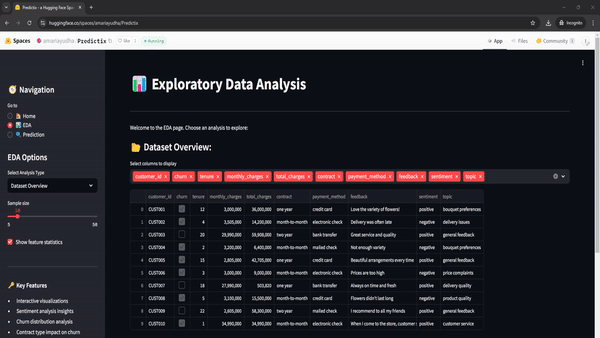
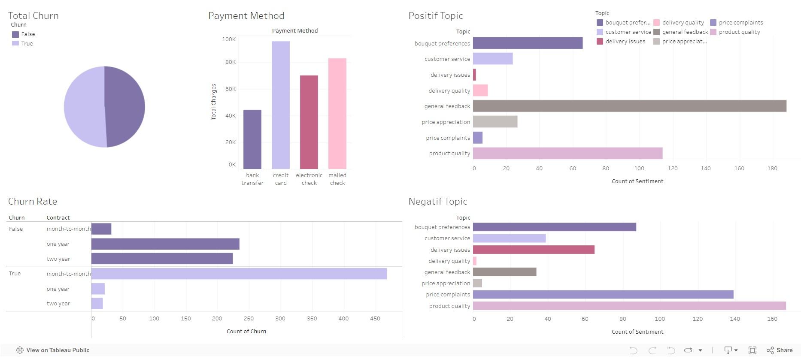

# Predictix: Predicting Customer Churn using NLP and Machine Learning 🌸🔮


<table style="width: 100%; text-align: center; border-collapse: collapse;">
    <tr>
        <th style="padding: 10px;">Dataset</th>
        <th style="padding: 10px;">Hugging Face</th>
        <th style="padding: 10px;">Tableau</th>
    </tr>
    <tr>
        <td style="padding: 10px;">
            <a href="https://huggingface.co/datasets/iammkb2002/florist_customer_churn">
                
            </a>
        </td>
        <td style="padding: 10px;">
            <a href="https://huggingface.co/spaces/amariayudha/Predictix">
                
            </a>
        </td>
        <td style="padding: 10px;">
            <a href="https://public.tableau.com/app/profile/yuliana.theresa/viz/FinalProject_17271749155140/Dashboard1?publish=yes">
                
            </a>
        </td>
    </tr>
</table>

## Demo 🎥

### Homepage

The homepage demo showcases the main interface of Predictix, providing an overview of the app's features and navigation options.

### EDA Section

The EDA (Exploratory Data Analysis) section demo illustrates how users can interact with various data visualizations and insights derived from the customer churn dataset.

### Prediction

The prediction demo demonstrates the process of inputting customer data and receiving churn predictions, showcasing the app's core functionality.

[Installation](#installation) | [Getting Started](#getting-started) | [Model Architecture](#model-architecture) | [Performance](#performance) | [Contributing](#contributing)


## Introduction 🌟

Predictix is an app designed to predict the likelihood of customer churn, with the ultimate goal of reducing churn rates and increasing customer satisfaction. By employing Natural Language Processing (NLP) and machine learning, this app analyzes customer feedback to predict sentiment, and then uses this sentiment analysis along with other features to predict whether customers will switch to other services or remain loyal.

### Problem Statement 🎯

In today's competitive market, understanding customer sentiment and predicting churn are crucial for business success. However, manually analyzing large volumes of customer feedback and identifying potential churners is time-consuming and prone to human error. Predictix addresses these challenges by automating both the sentiment analysis process and churn prediction, allowing businesses to respond promptly to customer needs and preferences.

### Objectives 🚀

1. Understand customer sentiment through their feedback
2. Build a model to classify sentiment in customer reviews
3. Use sentiment analysis results, combined with other features, to predict customer churn
4. Use SVC to predict customer churn.

### Proposed Solution 💡

Predictix utilizes a two-step approach:

1. Sentiment Analysis (`predictix_01_sentiment_analysis.ipynb`):
   - Uses advanced NLP algorithms, including BERT, to preprocess and analyze customer feedback data
   - Employs techniques such as tokenization, stopword removal, and sentiment classification

2. Churn Prediction (`predictix_02_churn_classification.ipynb`):
   - Utilizes the sentiment analysis results as a feature
   - Combines sentiment with other relevant features to predict customer churn using machine learning algorithms

This approach provides accurate and timely insights into customer sentiments and their likelihood of churning.

## Installation 🛠️

### Dependencies

-  Python 3.9+
-  PyTorch 2.0+
-  Transformers 4.40+
-  Pandas
-  NumPy
-  Scikit-learn
-  etc.

To install Predictix:
```bash
git clone https://github.com/ayudhaamari/predictix-nlp-sentiment-customer-churn.git
cd predictix-nlp-sentiment-customer-churn
```

## Getting Started 🚀

For the sentiment analysis, you can use the following code:
```python
from transformers import BertTokenizer, BertForSequenceClassification
import torch

# Load the tokenizer and model
tokenizer = BertTokenizer.from_pretrained('saved_model/')
model = BertForSequenceClassification.from_pretrained('saved_model/')
model.eval()

# Sample feedback
feedback = "The bouquet was absolutely stunning! Fresh flowers and beautiful arrangement."

# Tokenize and get prediction
inputs = tokenizer(feedback, return_tensors='pt', truncation=True, padding=True)
with torch.no_grad():
    outputs = model(**inputs)
    prediction = torch.argmax(outputs.logits, dim=1).item()

# Interpret prediction
sentiment = 'Positive' if prediction == 1 else 'Negative'
print(f"Sentiment: {sentiment}")

```
For overall classification churn, you can use this following code :
```python
# Import resources
import pandas as pd
import pickle

# Load the churn prediction model
with open('model.pkl', 'rb') as file:
    churn_model = pickle.load(file)

# Sample customer data
data = pd.DataFrame({
    'tenure': [17],
    'monthly_charges': [2800000],
    'total_charges': [47600000],
    'contract': ['one year'],
    'payment_method': ['mailed check'],
    'sentiment': ['Positive'],
    'topic': ['product quality']
})

# Predict churn
prediction = churn_model.predict(data)
result = 'Will Churn' if prediction[0] == 1 else 'Will Stay'
print(f"Churn Prediction: {result}")

```

## Model Architecture 🧠

Predictix uses a fine-tuned BERT model for sentiment analysis. The architecture includes:

- BERT base model
- Custom classification head
- Fine-tuning on florist-specific dataset

After conducting sentiment analysis using BERT, we employ cross-validation to identify the optimal classification model for the florist-specific dataset. The architecture includes the following base models:

- Support Vector Classifier (SVC)
- Decision Trees
- Random Forest
- K-Nearest Neighbors (KNN)
- Naive Bayes
- XGBoost
- Logistic Regression

To further enhance performance, we fine-tune the SVC model specifically for the florist-specific dataset.


## Performance 🚀

Our BERT-based model achieves:

- Train Accuracy: 92%
- Validation Accuracy: 94%
- Test Accuracy: 89%

This is the comparison of the performance of the model with other models used in the project:

| Model          | Train Accuracy | Validation Accuracy | Test Accuracy |
|----------------|----------------|---------------------|---------------|
| Random Forest  | 92%            | 91%                 | 87%           |
| LSTM           | 92%            | 92%                 | 89%           |
| BERT           | 92%            | 94%                 | 89%           |

Our fine-tune SVC model achieves:
- Training Recall : 93%
- Test Recall : 89%

This is the comparison of the performance of the model with other models used in the cross-validation for this project:

| Model | Recall - Mean - Cross Validation | Recall - std - Cross Validation | Recall - Range of Test Set |
|---|---|---|---|
| Support Vector Machine | 92.80% | 2.00% | 90.80% - 94.80% |
| Logistic Regression | 92.80% | 2.00% | 90.80% - 94.80% |
| K-Nearest Neighbors | 92.50% | 1.60% | 91.00% - 94.10% |
| Naive Bayes | 92.50% | 2.20% | 90.30% - 94.70% |
| Random Forest | 91.80% | 2.20% | 89.60% - 93.90% |
| XGBoost | 91.80% | 1.70% | 90.10% - 93.40% |
| Decision Tree | 90.50% | 2.70% | 87.90% - 93.20% |


## Dashboard Visualization 📊

The Tableau dashboard provides a comprehensive overview of the customer churn analysis. It offers interactive visualizations that help stakeholders understand key metrics and trends at a glance.



The dashboard includes:
- Customer churn distribution
- Payment method distribution
- Sentiment analysis distribution
- Key factors influencing churn
- Churn rate

You can access the full interactive dashboard [here](https://public.tableau.com/app/profile/yuliana.theresa/viz/FinalProject_17271749155140/Dashboard1?publish=yes).

## Acknowledgements

- Dataset provided by [Florist Customer Churn](https://huggingface.co/datasets/iammkb2002/florist_customer_churn)
- BERT implementation based on [Hugging Face Transformers](https://github.com/huggingface/transformers)
- Download the fine-tuned model from [Here](https://drive.google.com/drive/folders/1U7vDgiHhgMuuDl9noB3ESJm0yn0x2uPX?usp=sharing)


## Citation

If you use Predictix in your research, please cite:

```bibtex
@software{predictix2024,
  title  = {Predictix: Sentiment Analysis for Customer Churn Prediction},
  author = {Amari, Ayudha and Rahadian, Danisa and Erico, Muhammad and Theresa, Yuliana},
  year   = {2024}
}
```
